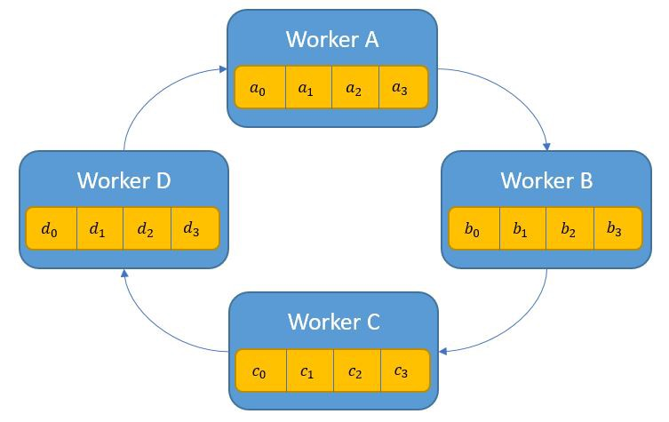

# Discussion and Future Work

Click <a href="https://yanlitao.github.io/fastDP/">here</a> to go back to Homepage.

## Table of Contents
1. [Goals Achieved](#goals-achieved)
  * [Data Processing](#data-processing)
  * [Distributed Computing](#distributed-computing)
2. [Future Work](#future-work)
  * [Advanced All-Reduce algorithms](#advanced-all-reduce-algorithms)
  * [Ring All-Reduce](#ring-all-reduce)

## Goals Achieved

### Data Processing

The dataset we used contains around 1.2 millions records, which contains some sensitive attributes that require differentially private training. We choose to carry out data preprocessing tasks on Spark. With the naive sequential routine, data preprocessing for our tabular dataset requires 78.52s. After using Spark, data preprocessing steps only took us about 3.5s, which is almost 22 times of the speed-up.

### Distributed DPSGD

We successfully distributed DPSGD training into multiple AWS GPU clusters and carried out experiments with varying number of nodes and GPUs. Through distributed parallelization, we reduced the runtime from 528s per epoch down to 170.86s per epoch when training with 4 GPUs. We carefully designed and implemented parallel DPSGD algorithm from scratch with AllReduce algorithm, and we obtained comparable performance as the version of using PyTorch built-in module. 

## Future Work

### Advanced All-Reduce algorithms

In the version 2 of our distributed training implementation, we implemented a Gradient AllReduce algorithm. As we said earlier, we realize that although the experiment results are promising for small number of computational nodes, there are still space for improving the scalability for distributed DPSGD by implementing AllReduce algorithm with less message sending and receiving. For the future work, we plan to further improve the performance by implementing more advanced AllReduce algorithms.

There are many other elegant designs of the All-Reduce algorithms. Some that try to minimize bandwidth, some others that try to minimize latency. 

 

(Figure 2 from [[Zhao, Canny]](https://arxiv.org/abs/1312.3020))

### Ring All-Reduce

Ring All-Reduce is the current state-of-art and is a very elegant example which pass the parameters around to each worker in a ring fashion. The ring implementation of Allreduce has two phases: the first one is the share-reduce phase, and then is the share-only phase. We want to implement this algorithm in the future, and it may remarkably improve the scalability of distributed DPSGD when the number of computational nodes are large.

 

(Figure 2 from [[Edir Garcia]](https://towardsdatascience.com/visual-intuition-on-ring-allreduce-for-distributed-deep-learning-d1f34b4911da))

## References
Zhao, H. and Canny, J., 2013. Sparse allreduce: Efficient scalable communication for power-law data. arXiv preprint arXiv:1312.3020.

Garcia, E., 2019. Visual intuition on ring-Allreduce for distributed Deep Learning. https://towardsdatascience.com/visual-intuition-on-ring-allreduce-for-distributed-deep-learning-d1f34b4911da
