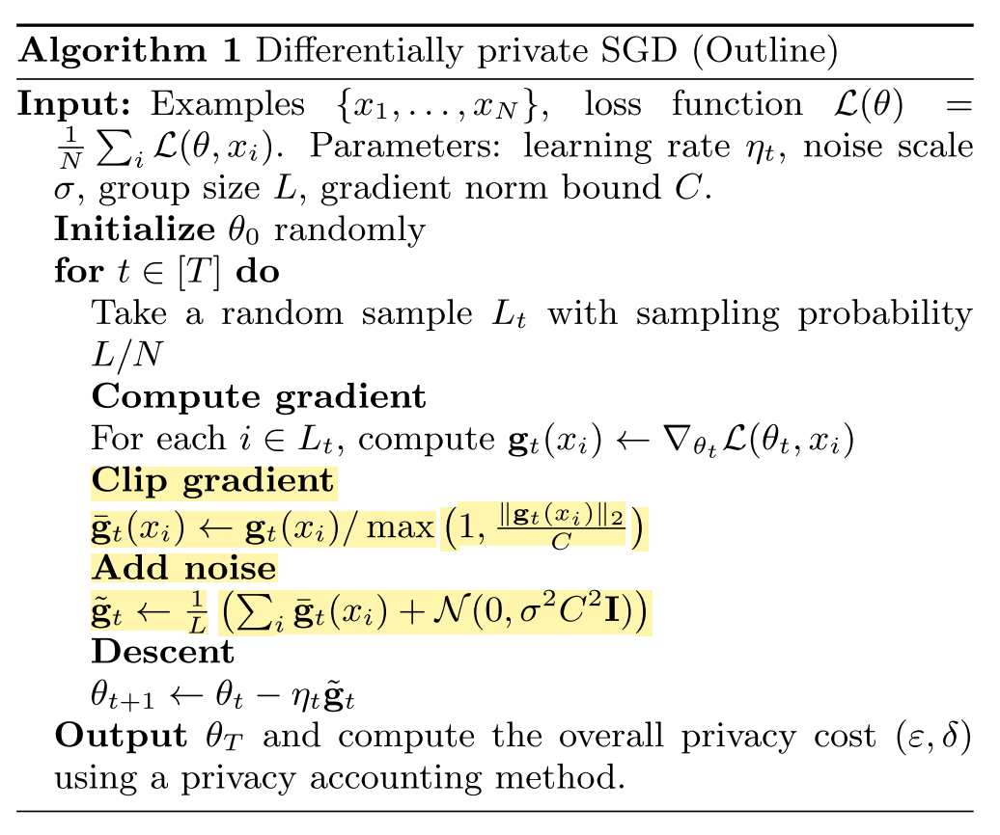
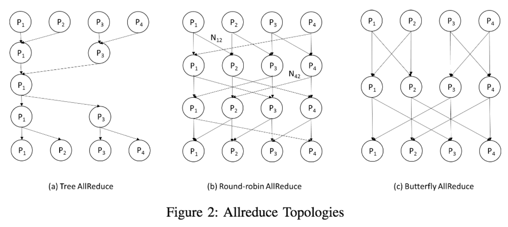
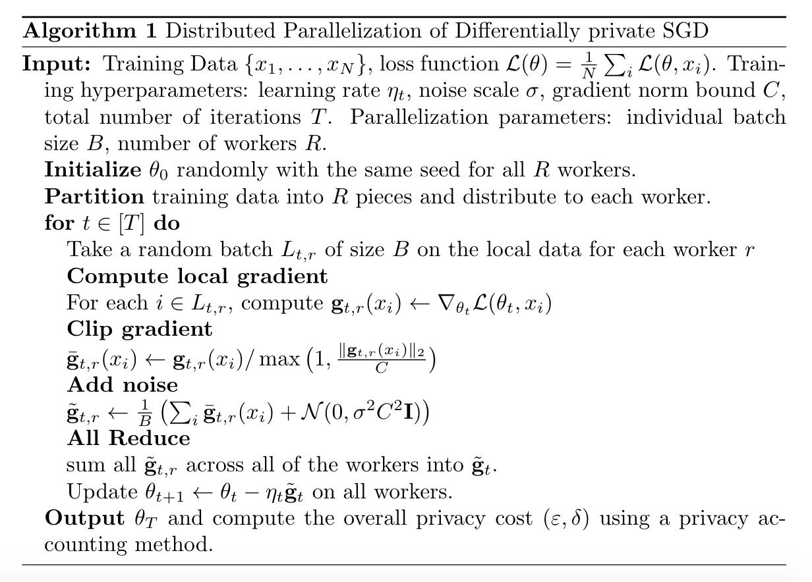
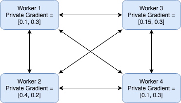

# Parallelization Design

Click <a href="https://yanlitao.github.io/fastDP/">here</a> to go back to Homepage.

## Table of Contents
1. [Data and Preprocessing](#data-and-preprocessing)
  * [Data Description](#data-description)
  * [Sequential Version](#sequential-version)
  * [Parallelized Version](#parallelized-version)
2. [Model Training](#model-training)
  * [Neural Network Architecture](#neural-network-architecture)
  * [Differential Private Stochastic Gradient Descent](#differential-private-stochastic-gradient-descent)
  * [Parallelization Design](#parallelization-design-1)
  * [Code Version 1: Distributed Data Parallel module](#code-version-1-distributed-data-parallel-module)
  * [Code Version 2: Implement from scratch](#code-version-2-implement-from-scratch)
  * [Backend & Infrastructure Choices](#backend--infrastructure-choices)

## Data and Preprocessing

### Data Description
Since a typical application of DPSGD is to work with sensitive data, we decided to choose a dataset which contains sensitive information but it is impossible to identify individual from the dataset.
Our data comes from American Community Survey Public Use Microdata Sample (PUMS) files. PUMS files are perfect for people, especially for students, who are looking for greater accessibility to inexpensive data for research projects. It includes useful but somehow sensitive census information such as Sex, Married Status, College degree. PUMS records do not contain names, addresses or any information that can identify a specific housing unit, group, or person.

### Data Overview
The figure below shows the format of our dataset. Our data has over 1 million records and 10 features in total. Our objective is to use this data to train a deep learning model to predict the unemployment rate based on other demographic information using DPSGD and HPC and HTC tools so that we can both protect privacy and obtain a satisfiable runtime of the algorithm.

From the above figure, we can see that the dataset is imbalanced. Since we have enough data and prediction accuracy is good in our pilot experiment, we did not modify data to much and focused on the improvement of running time and parallelization.

### Parallelization: MapReduce vs Spark?
    Within the data preprocessing stage, we tried both Spark and MapReduce to process the data. The main job is to remove invalid records, check missing value, and impute data. According to our experiments, Spark has much better performance than MapReduce. From the perspective of data processing, MapReduce has a linear dataflow structure: It reads input data from disk and store results on disk while Spark processes data in-memory. As a result, the speed of Spark may be up to 100 times faster than MapReduce. From the perspective of our data volume, it is large but fits in the Spark clusters’ RAM, so Spark outperforms MapReduce. Moreover, MapReduce contains a “sort” stage in data processing which is not necessary in our project and may add extra time for processing data. Another reason to choose Spark is Spark is easy to implement and has interactive modes. It makes our code extensible and flexible. 


## Model Training

### Neural Network Architecture
Since we are facing a classification problem, and we are working on a dataset with tabular format where there are no explicit correlations between columns, we choose multilayer perceptron (MLP) as our differentially private model to predict the unemployment rate. Hyperparameters such as number of layers and hidden dimensions are tuned on our dataset, with careful consideration for the tradeoff between model performance and total running time.


### Differential Private Stochastic Gradient Descent
Differential privacy is a framework for measuring the privacy guarantees provided by an algorithm. Through the lens of differential privacy, we can design machine learning algorithms that responsibly train models on private data. 
To train a differentially private model, we rely on Differentially Private Stochastic Gradient Descent (DPSGD) [[Abadi et al.]](https://arxiv.org/abs/1607.00133).  

As an optimization method, differential private SGD is developed from vanilla stochastic gradient descent, which is the basis for many optimizers that are popular in machine learning. There are two modifications needed to ensure that stochastic gradient descent is a differentially private algorithm:

- First, the sensitivity of each gradient needs to be bounded. In other words, we need to limit how much each individual training point can influence the gradient computation. This can be done by simply clipping each gradient computed on each training point. 

- Second, we need to randomize the algorithm’s behavior to make it statistically impossible to know whether or not a particular training data was included in the training set by comparing the gradient updates. This is achieved by sampling random Gaussian noise and adding it to the clipped gradients.



Because of the two extra steps of gradient clipping and noise addition, the execution time of DPSGD is about 100 times longer than the original DPSGD. Therefore, the parallelization of DPSGD is a significant work and will be a research hot-spot in the future. 

### Parallelization Design

#### Parallelization Design Choices Review   
There has been quite a bit of work on parallel machine learning approaches In this section, we review some design choices in distributed deep learning training. 

- Model Parallel vs Data Parallel  
    
    There are two approaches to parallelize the training of neural networks: *model parallelism* and *data parallelism*. Model parallel "breaks" the neural network into different parts and place different parts on different nodes. For instance, we could put the first half of the layers on one GPU, and the other half on a second one. However, this approach is rarely used in practice because of the huge communication and scheduling overhead [[Mao]](https://leimao.github.io/blog/Data-Parallelism-vs-Model-Paralelism/).
    
    Data parallelization divides the dataset across all available GPU per nodes, and each process holds a copy of the current neural network, called *replica*. Each node computes gradients on its own data, and they merge the gradients to update the model parameters. Different ways of merging gradients lead to different algorithms and performance [[Arnold]](http://seba1511.net/dist_blog/article.pdf). 
    
- Parameter Server vs AllReduce
    
    There are two options to setup the architecture of the system: *parameter server* and *tree-reductions*. For the case of parameter server, one machine is responsible for holding and serving the global parameters to all replicas, which serves as a higher-level manager process. However, as discussed in [[Arnold]](http://seba1511.net/dist_blog/article.pdf), parameter servers tend to have worse scalability than tree-reduction architectures. 
    
    Allreduce is an MPI-primitive which allows normal sequential code to work in parallel, implying very low programming overhead. This allows gradient aggregation and parameter updating. The massage-passing interface (MPI) and its collective communcation operations (e.g. scatter, gather, reduce) are used to implement AllReduce algorithm. The fundamental drawbacks are poor performance under misbalanced loads and difficulty with models that exceed working memory in size. There are many implementations of the AllReduce algorithm, as shown below.
    
     (Figure 2 from [[Zhao, Canny]](https://arxiv.org/abs/1312.3020))
    
- CPU vs GPU

	GPU(Graphics Processing Unit) is considered as heart of Deep Learning. While CPUs can run the operating system and perform traditional serial or multi-threading tasks, GPUs have strong vector processing capabilities that enable them to perform parallel operations on very large sets of data. GPU-accelerated computing is one kind of Heterogeneous Computing, which makes use of GPU together with a CPU to accelerate deep learning. 
    
In this project, we use **data parallelism** with **AllReduce appoach** and **GPU-accelerated computing** to implement distributed version of DPSGD. 

#### Distributed Parallelization of DPSGD
Based on the design choices we made above, we give the outline of the distributed version of DPSGD algorithm. In this algorithm, all workers average their gradients at every batch of data. Suppose the batch size for each replica (worker) is *B*, and the total number of replicas is *R*, then the **overall batchsize** is *BR*.
The following pseudo-code describes synchronous distributed DPSGD at the replica-level, for *R* replicas, *T* iteration steps, and *B* individual batch size.  

  

There are two main differences compared with sequential version of DPSGD: *data partition* and *gradient AllReduce*. For data partition stage, we divide the dataset into different pieces and assign each node one of the pieces. Later in the model training stage, each node will only sample batch data from its own portion of the data. This avoids the need of communicating the split of data across each node during the training stage. During the forward and backward propagation, each GPU will calcualte and process the corresponding gradient which involves clipping and noise addition. AllReduce is a combined operation of reduce and broadcast in MPI. In the *gradient AllReduce* step, all of the local gradients are averaged (reduction) and are used to update model parameters across all of the devices (broadcast).  

### Code Version 1: Distributed Data Parallel module  

We first decide to implement a version of distributed DPSGD using PyTorch Distributed Data Parallel module with CUDA. 
Distributed Data Parallel module is a compact, well-tested and well-optimized version for multi-GPU distributed training. When we wrap up our model with DistributedDataParallel, the constructor of DistributedDataParallel will register the additional gradient reduction functions on all the parameters of the model at the time of construction so that we do not need to explicitly handle gradient aggregation and parameter updates across the computational nodes during the model training.

```python
dp_device_ids = [local_rank]
device = torch.device('cuda', local_rank)
model = Network()
model.to(device)
model = torch.nn.parallel.DistributedDataParallel(model, device_ids=dp_device_ids)
```

 Besides that, we use PyTorch Distributed Sampler module to implement a data sampler to automatically distribute data batch instead of hand-engineer data partition. 
 
```python
train_sampler = torch.utils.data.distributed.DistributedSampler(trainset)
train_loader = torch.utils.data.DataLoader(trainset, batch_size=batch_size, sampler=train_sampler)
```

    
### Code Version 2: Implement from scratch

Since we found that although PyTorch Distributed Data Parallel is capable of handling training data partition, gradient aggregation and parameter updates automatically, it also introduces a large setup overhead to accomodate a various of situations. Since we are dealing with the parallelization of the specific case of DPSGD, we decide to directly implement distributed DPSGD from scratch, where multi-GPU communication is supported by PyTorch distributed library. 

As discussed above, there are two main differences for distributed version compared with sequential version for DPSGD: *data partition* and *gradient AllReduce*. For data partition stage, we divide the dataset into equal size of pieces and assign each node one of the pieces. Later in the model training stage, each node will only sample batch data from its own portion of the data. This avoids the need of communicating the split of data across each node during the training stage. For *gradient AllReduce* stage, each node will send its local gradient to all other nodes, and each node will compute the gradient average and update its own parameter. The message passing figure illustration is given here:



This way of implementing AllReduce algorithm has several advantages: the computation is completely deterministic. It's simple to implement, and easy to debug and analyze. However, we note that this approach is not ideal. It sends unnecessary messages, which can increase the communication overhead. In our experiment, since we are not able to request more than 4 GPU devices from AWS, the communication overhead is not significant and this version of code obtained comparable performance with Code Version 1. We leave the implementation of more fine-grained AllReduce algorithm (e.g. Tree AllReduce, Round-robin shown above) as our future work. 

### Backend & Infrastructure Choices  

Pytorch Distributed package is abstract and can be built on different backends. Our choices including Gloo and NCCL. However, since we are mainly working with CUDA tensors, and the collective operations for CUDA tensors provided by Gloo is not as optimized as the ones provided by the NCCL backend, we decide to use NCCL backend through out all of the experiments. 

We decide to use AWS EC instances as the computing infrastructure for its flexibility to customize with different environments. Since AWS G3 instances are relatively more cost-effective than P2 type instances, we choose mostly G3 for our experiments. G3 instances are back up with NVIDIA Tesla M60 GPUs, where each GPU delivering up to 2,048 parallel processing cores and 8 GiB of GPU memory.   

To save cost on storage and to prevent from uploading/downloading multiple copies of the data, we share the data folder through Network File System (NFS).

Click <a href="https://yanlitao.github.io/fastDP/Performance_Results">here</a> to see our experiment results.


