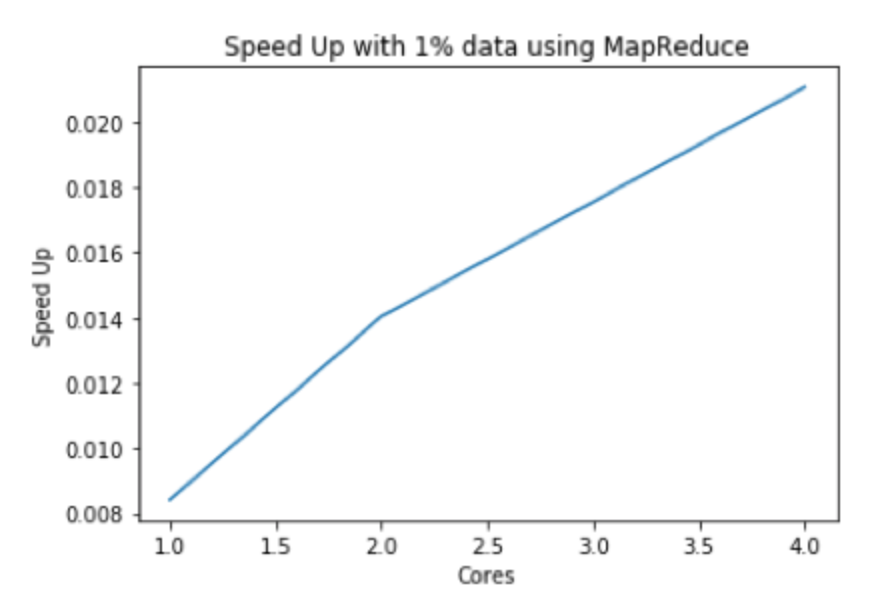
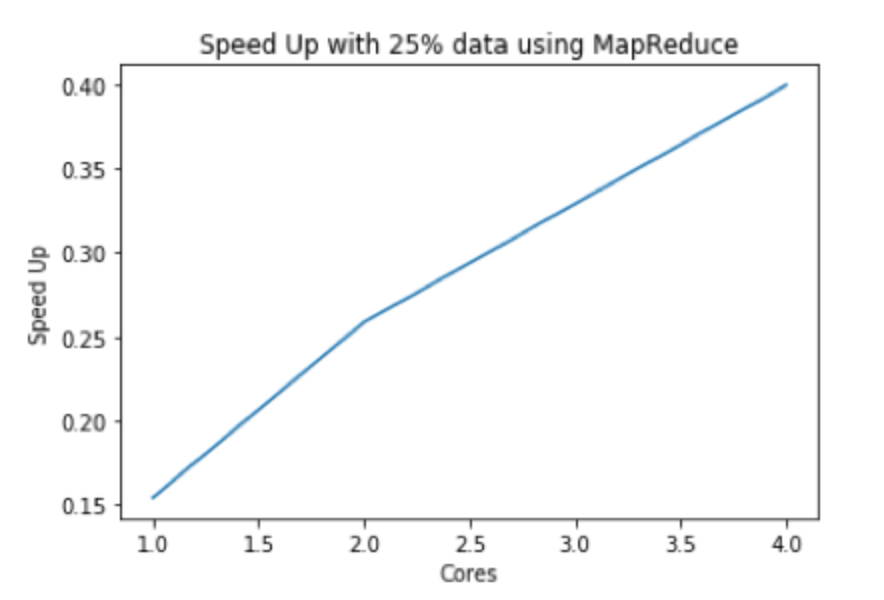
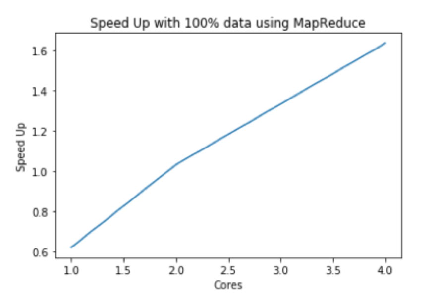
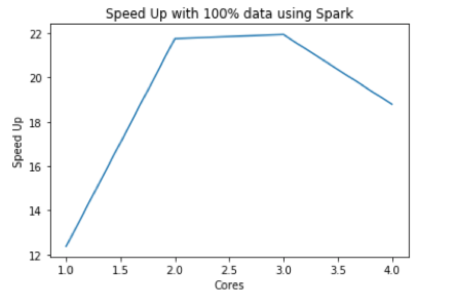
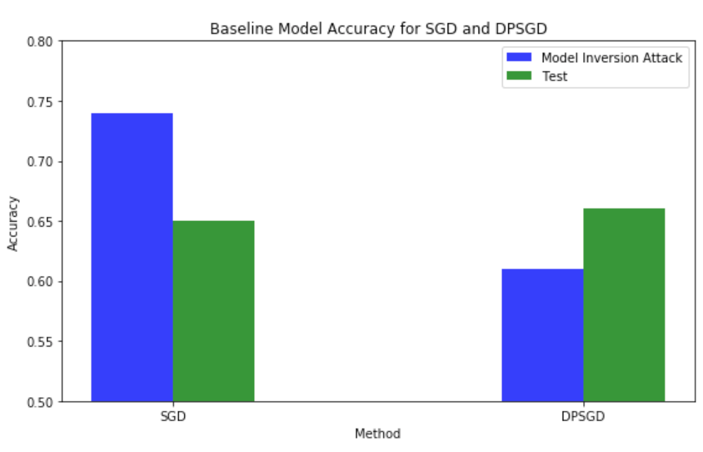
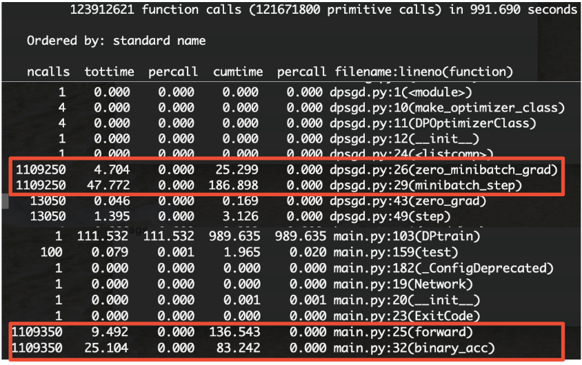
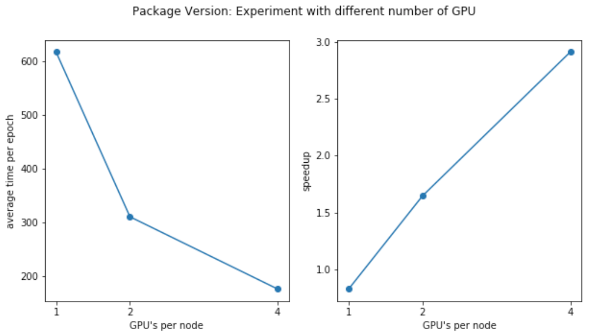
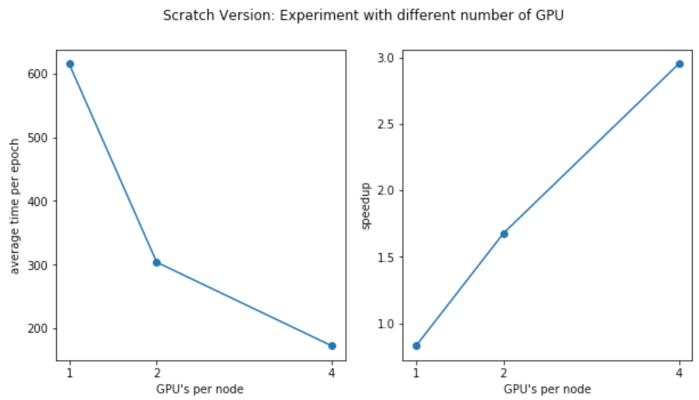
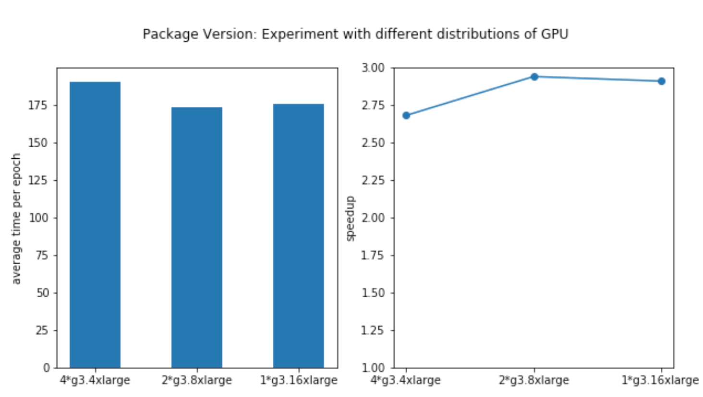
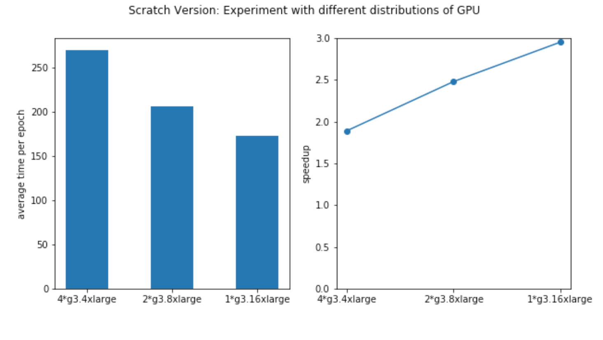

# Experiments & Performance Results

Click <a href="https://yanlitao.github.io/fastDP/">here</a> to go back to Homepage.

## Table of Contents
1. [Metrics of Performance](#metrics-of-performance)
2. [Data Preprocessing](#data-preprocessing)
  * [MapReduce Data Processing](#spark-data-processing)
  * [Spark Data Processing](#distributed-dpsgd)
3. [Distributed DPSGD](#distributed-dpsgd)
  * [Code Baseline](#code-baseline)
  * [Experiment with Different Number of GPUs](#experiment-with-different-number-of-gpus)
  * [Experiment with Different Distributations of GPUs](#experiment-with-different-distributations-of-gpus)
  * [Money-Efficiency Tradeoff](#money-efficiency-tradeoff)

## Metrics of Performance

To correctly measure the performance of the parallelized program, we focus on the following metrics:

- Average execution time per epoch: for each experiment we run 10 epochs for differentially private training, and we use average execution time per epoch as the indicator of training speed. The recorded time only includes DP training loop, since for the extra steps, such as cross validation, are not absolutely necessary and it makes no sense to include them when calculating training time. 

- Speedup: speedup is an indicator that measures the relative performance of two systems processing the same problem. Specifically, if the amount of time to complete a work unit with 1 processing element is T1, and the amount of time to complete the same unit of work with n processing elements is Tn, the strong scaling speedup is T1/Tn. We use **strong scaling speedup** in all of the experiments.

**Special Note for Measuring Scalability of Learning Algorithm**

In usual computer science algorithm, we measure the numerical complexity of a problem as a function of input size, but for a learning algorithm, it does not make sense to define the problem size to be the size of training set [[Shalev-Shwartz, Ben-David]](https://www.cs.huji.ac.il/~shais/UnderstandingMachineLearning/understanding-machine-learning-theory-algorithms.pdf). If we give the learning algorithm a very large training set, which is much larger than the sample complexity (the minimal size of training set required for good generalization) of the learning problem, the algorithm can simply ignore the extra examples. Therefore, a larger training set does not make the learning problem more difficult, and, consequently, the runtime available for a learning algorithm should not increase as we increase the size of the training set. To avoid the conceptual controversy, we decided to fix the size of our training data in all of our experiment and always measure strong scaling speedup. 

**Special Note for the Batch Size in Distributed Training**

Another experiment detail we would like to mention is our way to benchmark a distributed framework. There are many controversies about how to set the batch size in distributed training. After many discussions within our group and with TFs, we decided to keep the **overall batch size fixed** in all of our experiment. The reason is that we are trying to mimic the behavior of a sequential implementation. This means that when we increase the number of computational devices, we will rescale the local batch size by the number of replicas. For example, we set batch size to be 256 when measuring the baseline sequential DPSGD, we will set the local batch size to be 128 when we have two GPUs. 

## Data Preprocessing

### MapReduce Data Processing

 * Results

| Percentage of Full Dataset | Sequential Time | with 1 cores | with 2 cores | with 4 cores |
|----------------------------|-----------------|--------------|--------------|--------------|
| 1%                         | 0\.927s         | 110s         |66s           | 44s          |
| 25%                        | 17\.579s        | 114s         | 68s          | 44s          |
| 100%                       | 78\.52s         | 126s         | 76s          | 48s          |
 
|  |   | |
|:-------------------------:|:-------------------------:|:-------------------------:|
|Speed-up with 1% data using MapReduce|Speed-up with 25% data using MapReduce|Speed-up with 100% data using MapReduce|
 
**analysis:**
The table shows that the sequential data processing code is even more efficient in most cases than using MapReduce, especially when the dataset is small. Only when we process full dataset with more than 2 cores does MapReduce show its power. This is because MapReduce contains many extra steps such as splitting and sorting which is only suitable for large data that does not even able to fit into RAM. Using MapReduce with multiple cores can help us decrease the running time, and we can observe almost linear speedups with it.

### Spark Data Processing

 * Results

| Percentage of Full Dataset | Sequential Time | 1 cores  | 2 cores   | 3 cores    | 4 cores    |
|----------------------------|-----------------|----------|-----------|------------|------------|
| 100%                       | 78\.52s         | 6\.3429s | 3\.61228s | 3\.587001s | 4\.185391s |

 
 
 **analysis:**
 Compared to MapReduce, Spark runs much faster. The speedup is more than 20 when we use 2 or 3 cores. Also, the figure implies that it is not wise to use more than 2 cores for our dataset because using more cores might get even worse performance due to the excessive parallelization. So the best option for data processing might be Spark with 2 cores. However, this result is dependent on the hardware conditions. Since we used a m4.xlarge instance that has 4 cores but only two physical working cores, when we increased the number of core to 3 or 4, some time was taken by context switching rather than computing. Thus the speedup of 4 cores is smaller than 2 or 3 cores.

## Distributed DPSGD

### Code Baseline

**Original SGD vs Original DPSGD**
Compared to the original SGD, DPSGD could achieve approximately similar test accuracy in terms of prediction. The runtime of DPSGD is significantly slower than the original one, and the bottleneck of the algorithm is mainly the gradient clipping and noise addition in backpropagation, as shown in the code profiling below. However, the upside of using this optimizer is we could better protect the privacy of data while training the model. Here we have demonstrated that by using DPSGD, the model can better protect training data from model inversion attack1 by lowering the attacker’s accuracy.

Model inversion attack is a famous privacy attack against machine learning models, which is first proposed by [[Fredrikson et al.]](https://www.usenix.org/node/184490). The access to a model is abused to infer information about the training data, which raised serious concerns given that training data usually contain privacy sensitive information. We use the success rate of model inversion attack as the benchmark for the effectiveness of DP training.

| Algorithm        | Max time \(s\) | average time \(s\) | Min time \(s\) | Test Acc  | Model Inversion Attack Acc |
|------------------|----------------|--------------------|----------------|-----------|----------------------------|
| Sequential SGD   | 5\.322         | 5\.15              | 5\.104         | 0\.66     | 0\.74                      |
| Sequential DPSGD | 528            | 510                | 487            | 0\.66     | 0\.61                      |

**Code Profiling Results**

### Experiment with Different Number of GPUs
In order to measure the **strong scalability** of our distributed training model, we run our two version of programs on the dataset with different number of GPUs. Specifically, we tried 1 GPU (1 g3.4xlarge instances), 2 GPUs (2 g3.4xlarge instances), 4 GPUs (4 g3.4xlarge instances). The results are shown in the following tables and figures. 
 
 
 **Code Version 1 (package version)**

| \# of Nodes     | \# GPUs per Node | Max time \(s/epoch\) | Average time \(s/epoch\) | Min time \(s/epoch\) | Test Acc |
|-----------------|------------------|----------------------|--------------------------|----------------------|----------|
| 1\*g3\.4xlarge  | 1                | 619                  | 617                      | 616                  | 0\.62    |
| 1\*g3\.8xlarge  | 2                | 312                  | 310                      | 309                  | 0\.62    |
| 1\*g3\.16xlarge | 4                | 181                  | 178                      | 175                  | 0\.615   |

Since we are using strong scaling to measure distributed training speedup, each GPU will handle a smaller part of data as the number of GPU increases. From above we can see that the time of each epoch decreases is almost proportional to the number of GPU increases. We note that it's not perfectly linear speedup because of data partition and communication overheads.

**Code Version 2 (scratch version)**

| \# of Nodes     | \# GPUs per Node | Max time \(s/epoch\) | Average time \(s/epoch\) | Min time \(s/epoch\) | Test Acc |
|-----------------|------------------|----------------------|--------------------------|----------------------|----------|
| 1\*g3\.4xlarge  | 1                | 624                  | 615                      | 611                  | 0\.647   |
| 1\*g3\.8xlarge  | 2                | 311                  | 304                      | 298                  | 0\.65    |
| 1\*g3\.16xlarge | 4                | 174                  | 173                      | 171                  | 0\.656   |

As we can see, Version 2 of the distributed training program achieves  similar and sometimes even better performance than the Version 1 (package version) of the data. Given the fact that `DistributedDataParallel` module is an official, well-tested and well-optimized version, this shows that our own implementation of AllReduce algorithm is a success and has great scalability. 

### Experiment with Different Distributations of GPUs
We also experimented our implementation when the total number of GPUs is fixed but distributed on different nodes. Specifically, with total 4 GPUs, we train the model on 1 node with 4 GPUs (1 g3.16xlarge instance), 2 nodes with 2 GPUs (2 g3.8xlarge instance, each only use 2 GPUs) and 4 nodes with 1 GPUs (1 g3.4xlarge instance). The results are shown in the following tables and figures:
 
 
 **Code Version 1 (package version)**
 
| \# of Nodes                | \# GPUs per Node | Max time \(s/epoch\) | Average time \(s/epoch\) | Min time \(s/epoch\) | Test Acc |
|----------------------------|--------------|--------------|--------------|--------------|--------------|
| 4\*g3\.4xlarge \(1 GPU\)   | 1                | 191\.8               | 190\.3                   | 189\.3               | 0\.615   |
| 2\*g3\.8xlarge \(2 GPUs\)  | 2                | 176\.8               | 173\.05                  | 174\.9               | 0\.615   |
| 1\*g3\.16xlarge \(4 GPUs\) | 4                | 181\.4               | 175\.3                   | 177\.6               | 0\.615   |

The clusters achieve approximately the same speedup, while the node with 4 GPU builtin achieves the best performance. We think this is mainly because it has only intra-node communication which is lower than internode communication overhead.

**Code Version 2 (scratch version)**

| \# of Nodes                | \# GPUs per Node | Max time \(s/epoch\) | Average time \(s/epoch\) | Min time \(s/epoch\) | Test Acc |
|----------------------------|--------------|--------------|--------------|--------------|--------------|
| 4\*g3\.4xlarge \(1 GPU\)   | 1                | 273\.9               | 269\.8                   | 265\.3               | 0\.654   |
| 2\*g3\.8xlarge \(2 GPUs\)  | 2                | 209\.8               | 205\.7                   | 204\.9               | 0\.656   |
| 1\*g3\.16xlarge \(4 GPUs\) | 4                | 174\.3               | 172\.8                   | 170\.86              | 0\.656   |

For Code Version 2 (scratch version), we find that the performance is worse than Code Version 1 for 4*g3.4xlarge's case. We suspect that this is because our version of code is not fully optimized for inter-node communication, which can be an interesting future work. 

### Money-Efficiency Tradeoff

| Experiment      | \# GPU | Time \(s\) | price / hour | Cost   |
|-----------------|--------|------------|--------------|--------|
| 1\*g3\.4xlarge  | 1      | 6300       | 1\.14        | 1\.995 |
| 1\*g3\.8xlarge  | 2      | 3205       | 2\.28        | 2\.03  |
| 1\*g3\.16xlarge | 4      | 1813       | 4\.56        | 2\.3   |
| 4\*g3\.4xlarge  | 4      | 2144       | 4\.56        | 2\.72  |
| 2\*g3\.8xlarge  | 4      | 1937       | 4\.56        | 2\.45  |

g3.4xlarge is the cheapest instance among all AWS clusters that has GPU device, but it is also pretty slow compared to multi-GPU clusters.
g3.16xlarge is the fastest one among all GPU instances, as it only has intra-node communication which is much faster than inter-node communication, which is very significant in distributed training.
Hence, in our case the single node GPUs are usually best money for value given the lower overhead involved. So, we conclude that one can go for any single node multi GPUs for the best combination of speed and price.

Click <a href="https://yanlitao.github.io/fastDP/Discussion">here</a> to see our discussion.
