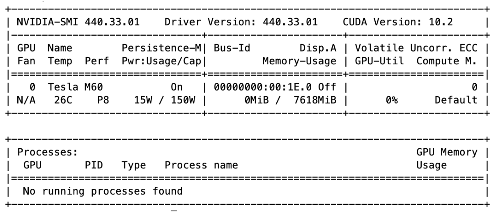

# Reproduction

Click <a href="https://yanlitao.github.io/fastDP">here</a> to go back to Homepage.

## Table of Contents
1. [Data Processing](#data-processing)
  * [MapReduce](#mapreduce)
  * [Spark](#spark)
2. [Distributed DPSGD with GPU acceleration](#distributed-dpsgd-with-gpu-acceleration)

## Data Processing

### MapReduce

**1. Launch Hadoop EMR cluster**

>a. login **AWS EMR** and select **Create cluster**. You can select the following configuration:
    
>>ClusterName: MySpark
        
>>Launch mode “Cluster”
        
>>Release: 5.29.0
        
>>Applications: Spark
        
>>Instance type: m4.xlarge
        
>>Number of Instances: 3
   
>b. Click on “Create Cluster” and wait for the cluster to be ready. The cluster is ready when its state is “Waiting” and the Master and Core under the **Networks and hardware** section are both in “Running” state.
   
**2. Submit a MapReduce job**

>a. Upload `mapper.py`, `reducer.py` and `input.py` files to a new S3 bucket. Create a S3 bucket, and name it.
    
>b. Go to the Hadoop cluster dashboard’s **Steps** tab and click on “Add Step” with the following configuration:
    
>>Step type: Streaming program
        
>>Name: MyHadoopJob
        
>>Mapper: Complete path to uploaded mapper
        
>>Reducer: Complete path to uploaded reducer
        
>>Input: Complete path to uploaded input
        
>>Output: Complete path to new folder to be created with the output (it should not exist)
     
>c. Wait for the “step” to be “completed”;
     
>d. After “completed” you can check the execution time in the `controller` log file;
     
>e. If the job is not successfully “completed”, you can check the logging files for further information;
     
>f. Finally, check the results in the bucket, Hadoop creates one output file for each executed reducer task.
     

### Spark

**1. Launch Hadoop EMR cluster**

>a. login **AWS EMR** and select **Create cluster**. You can select the following configuration:
    
>>ClusterName: MySpark
        
>>Launch mode “Cluster”
        
>>Release: 5.29.0
        
>>Applications: Spark
        
>>Instance type: m4.xlarge
        
>>Number of Instances: 3
        
>>Key pair: see Guide “First Access to AWS”
        
>b. Click on “Create Cluster” and wait for the cluster to be ready. The cluster is ready when its state is “Waiting” and the Master and Core under the Networks and hardware section are both in “Running” state;
    
**2. Login to the cluster**
    
>a. Write down the “Master public DNS” and click on the SSH link next to it. The SSH link gives you the commands you might use to login to your cluster;
    
>b. SSH to the machine using the private key. A sample command is as depicted (modify accordingly). `$ ssh -i $HOME/.ssh/course-key.pem hadoop@ec2-34-229-72-173.compute-1.amazonaws.com`

**3. Submit a Spark Script** 
    
>a. Upload to the master VM the Spark `process_spark.py` script and the `Ca5PUMS.csv` file;
    
>b. Upload the `Ca5PUMS.csv` file to the Hadoop file system: 
        
>>`$ hadoop fs -put Ca5PUMS.csv`
        
**4. Parallel Execution on Multiple Nodes**

>a. Using the following command to execute the script on **2 executors** (worker nodes) with **4 threads per executor**, achieving the execution of **8 simultaneous tasks**:
    
>>`$ spark-submit --num-executors 2 --executor-cores 4 process_spark.py`

## Distributed DPSGD with GPU acceleration

### Infrastructure Deploying & Environment Setup

**1. Creating the Nodes**

>a. login **AWS EC2** and select **Launch Instance**.
  
>b. Choose an **Amazon Machine Image (AMI)** - Here we will select the **Deep Learning AMI (Ubuntu 16.04) Version 28.1**. 
  
>c. Choose an Instance Type - Choose **g3.4xlarge** for testing multiple nodes with 1 GPU each; choose **g3.8xlarge** for testing multiple nodes with multiple GPU;
  
>d. Configure Instance Details - We only need to increase the **number of instances** to **2**;
  
>e. Add Storage - The default setting of storage is only 75 GB. And the default storage is enough for the STL-10 dataset. But, if you want to train on a larger dataset such as ImageNet, you will have to add much more storage just to fit the dataset and any trained models you wish to save;
  
>f. Add Tags - Directly click on the next step;
  
>g. Configure Security Group - This is a critical step. By default two nodes in the same security group would not be able to communicate in the distributed training setting. Here, we want to create a new security group for the two nodes to be in. However, we cannot finish configuring in this step. For now, just remember your new security group name (e.g. launch-wizard-12) then move on to next step;
  
>h. Review Instance Launch - Here, review the instance then launch it. By default, this will automatically start initializing the two instances. You can monitor the initialization progress from the dashboard.

**2. Environment Setup**
  
>a. activate the pytorch environment: `source activate pytorch_p36`;
  
>b. Install the latest Pytorch 1.1: `conda install pytorch cudatoolkit=10.0 -c pytorch`;
  
>c. Find the name of private IP of the node by running `ifconfig` (usually `ens3`) and export it to NCLL socket: `export NCCL_SOCKET_IFNAME=ens3` (add to `.bashrc` to make this change permanent);
  
>d. Upload the scripts to each node or `git clone` from the repository;
  
>e. Also, upload the data to each node if running without NFS (Network File System) setup;
  
>f. Repeat above steps on each node.

**3. Set up NFS**

Let `master$` denote master node and `$node` denote any other nodes.
  
Run the following commands on master node:
  
>a. Install NFS server: `master$ sudo apt-get install nfs-kernel-server`;
  
>b. Create NFS directory: `master$ mkdir cloud`;
  
>c. Export cloud directory: by executing `master$ sudo vi /etc/exports` to open the `/etc/exports` and add `/home/ubuntu/cloud *(re,sync,no_root_squash,no_subtree_check)` to it;
  
>d. Update the changes: `master$ sudo exportfs-a`;
  
Configure the NFS client on other nodes:

>a. Install NFS client: `node$ sudo apt-get install nfs-common`;
  
>b. Create NFS directory: `node$ mkdir cloud`;
  
>c. Mount the shared directory: `node$ sudo mount -t nfs <Master Node Private IP>:/home/ubuntu/cloud /home/ubuntu/cloud`;
  
>d. Make the mount permanent (optional): add the following line `<Master Noder Private>:/home/ubuntu/cloud /home/ubuntu/cloud nfs` to `/etc/fstab` by executing `node$ sudo bi /etc/fstab`.

### Running the Program

**1. Getting the code processed data**


**2. Runnng the sequential version of DPSGD**

Run the following command on one node:
```
python seq_main.py --num_epoch=<# epoch to run> --path=<path of training data> --l2_norm_clip=<gradient norm bound> --noise_multiplier=<gradient noise multiplier> --batch_size=<batch size> --minibatch_size=<minibatch size for DPSGD> --lr=<learning rate>
```

If you want to profile the sequential code and analyze the "hot-spot" of the program, you can use python `cProfile` library, and run command:
```
python -m cProfile -o seq_main.profile seq_main.py --num_epoch=<# epoch to run> --path=<path of training data> --l2_norm_clip=<gradient norm bound> --noise_multiplier=<gradient noise multiplier> --batch_size=<batch size> --minibatch_size=<minibatch size for DPSGD> --lr=<learning rate>
```


**3. Running the distributed version of DPSGD**

- Run version 1 of distributed DPSGD (based on DistributedDataParallel module)
```
python dist_main_v1.py --size=<total # of processes> --master_ip=<private ip addr of master node> --master_port=<a free port of master node> --rank=<global rank of current process> --local_rank=<local rank of current process> --dist_backend=<backend of PyTorch Distributed Library> --num_epoch=<# epoch to run> --workers=<# workers> --path=<path of data> --l2_norm_clip=<gradient norm bound> --noise_multiplier=<gradient noise multiplier> --batch_size=<global batch size> --minibatch_size=<minibatch size for DPSGD> --lr=<learning rate>
```

	For example, when we have 2 nodes and each with 1 GPU, we can run
	```
	python dist_main_v1.py --size=2 --master_ip=172.16.254.1 --master_port=23456 --rank=0 --local_rank=0 --dist_backend=nccl --num_epoch=10 --workers=2 --path='./CaPUMS5full.csv' --l2_norm_clip=3 --noise_multiplier=0.9 --batch_size=256 --minibatch_size=3 --lr=0.01
	```
	on the first node, and run 
	```
	python dist_main_v1.py --size=2 --master_ip=172.16.254.1 --master_port=23456 --rank=1 --local_rank=0 --dist_backend=nccl --num_epoch=10 --workers=2 --path='./CaPUMS5full.csv' --l2_norm_clip=3 --noise_multiplier=0.9 --batch_size=256 --minibatch_size=3 --lr=0.01
	```
	on the second node. 

- Run version 2 of distributed DPSGD (implemented from scratch)
	
	When all of the nodes have only one GPU device, the way to run Version 2 of code is exactly the same as the way to run Version 1. 
	
	When we have nodes that contain multiple GPUs (e.g. g3.8xlarge or g3.16xlarge), for the first process that uses device `'cuda:0'`, the command are exactly the same as above. However, process that uses device 'cuda:x', we should run:  
	```
CUDA_VISIBLE_DEVICES=x python dist_main_v2.py --size=<total # of processes> --master_ip=<private ip addr of master node> --master_port=<a free port of master node> --rank=<global rank of current process> --local_rank=<local rank of current process> --dist_backend=<backend of PyTorch Distributed Library> --num_epoch=<# epoch to run> --workers=<# workers> --path=<path of data> --l2_norm_clip=<gradient norm bound> --noise_multiplier=<gradient noise multiplier> --batch_size=<global batch size> --minibatch_size=<minibatch size for DPSGD> --lr=<learning rate>
	```
	For example, when we are using one g3.8xlarge node with 2 GPUs, for the process that uses `'cuda:1'`, we can run 
	```
	CUDA_VISIBLE_DEVICES=1 python dist_main_v2.py --size=2 --master_ip=172.16.254.1 --master_port=23456 --rank=0 --local_rank=0 --dist_backend=nccl --num_epoch=10 --workers=2 --path='./CaPUMS5full.csv' --l2_norm_clip=3 --noise_multiplier=0.9 --batch_size=256 --minibatch_size=3 --lr=0.01
	```
	Note that here the local rank of this process is 0 since this process only sees one GPU device. `CUDA_VISIBLE_DEVICES=1` is mainly used to prevent runtime error that arguments may contain in different GPUs. 
	
	
## System Information

### Software Version
- Python 3.6.5
- PyTorch 1.1.0

### CUDA GPU Information



### AWS Instance Information


