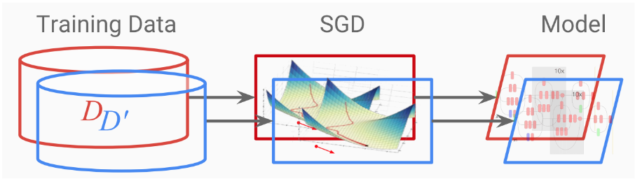

# Introduction

## Motivation
Differential privacy is a general framework for measuring the privacy guarantees provided by an algorithm working with sensitive dataset. We can design differentially private machine learning algorithms to train on sensitive data with a promising balance of utility-privacy tradeoff. Differential private training provides provable guarantees of privacy (point to first image), reducing the risk of exposing sensitive training data through the learned classifier. Intuitively, for any two adjacent training sets that are only differed by one data record, the learned classifiers should not be too different. **In the context of deep learning, differential private stochastic gradient descent, i.e. DPSGD, is the state-of-art algorithm to train such a privacy-preserving neural network.**

## The Need for Big Data and HPC
Nowadays, the DPSGD algorithm is in urgent need of combining with big compute and big data technology. On the one hand, due to the algorithm features of the DPSGD (limiting the gradient size in each step of parameter update), its convergence time will be 10 to 100 times longer than that of the original SGD algorithm. Without the employment of HPC, the naive sequential training with DPSGD will be extremely time-consuming. On the other hand, the sensitive datasets processed by DPSGD will typically be up to thousands of petabyte. For example, in some high-tech companies, they need to process billions of private user data every day, and it is impossible to process data without big data processing. Therefore, in this project, we improve the efficiency of DPSGD algorithm by using big compute (distributed training) and big data technology (Spark), which made DPSGD possible to be applied to more complex application scenario and work with huge amount of sensitive data. 

## Main Features

### Overview DPSGD Algorithm
As an optimization method, differential private SGD is developed from original SGD. In the process of parameter updating, there are two more important steps for DPSGD in each iteration: gradient clipping and noise addition. These two steps reduce the effect of one single anomaly so that the results of two similar datasets will not be too different. In our profiling analysis, these two steps are also the time-consuming hot-spot. 

### Dataset
Our data comes from American Community Survey Public Use Microdata Sample (PUMS) files. It includes useful but somehow sensitive census information such as Sex, Marrital Status, College degree. Our task is to privately train a deep learning model to predict the unemployment rate based on other demographic information using DPSGD, with the aid of big data and HPC tools so that we can both protect privacy as well as obtain a satisfiable runtime of the algorithm.

### Solutions
Our solution separates into two stages, data preprocessing and the DPSGD training. Accordingly, the levels of parallelism we are implemented are **big data** and **distributed parallelization technology**. To be more specific, within the data preprocessing stage, we use Spark to process large amount of data. This is because in our experiments, Spark runs much faster than MapReduce. For the model training stage, we specifically designed a new distributed version of DPSGD with gradient AllReduce step. We implemented two versions of distributed parallelism of DPSGD, one is based on PyTorch Distributed Data Parallel module and another one is implemented from scratch, where multi-GPU communication is based on PyTorch distributed package with NCCL backend. 

In terms of the infrastructure, since we didn't get approve from AWS to get more than 5 g3.4xlarge instances, we use at most 4 g3.4xlarge (or 2 g3.8xlarge, or 1 g3.16xlarge) instances to run the distributed version of DPSGD. 

## Table of Contents

- [Parallelization Design](http://YanLitao.github.io/fastDP/Parallelization_Design)
- [Reproduction](http://YanLitao.github.io/fastDP/Reproduction)
- [Performance Results](http://YanLitao.github.io/fastDP/Performance_Results)
- [Discussion](http://YanLitao.github.io/fastDP/Discussion)

## Acknowledge
When we did this project, we got lots of help from our TFs: Dylan Randle, Hayoun Oh, Zhiying Xu, Zijie Zhao and our Instructor David Sondak, Ignacio M. Llorente and Bill Richmond. We would like to thank them for their time and kindness during this special time, and express our deepest appreciation to their help.
 
